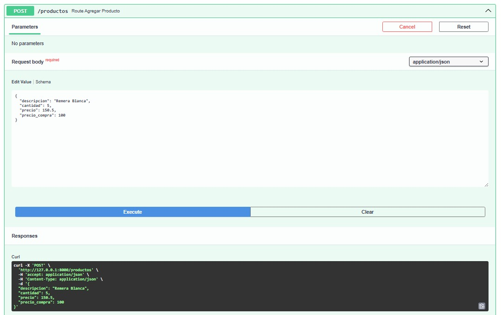
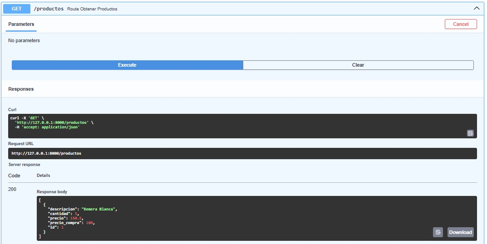
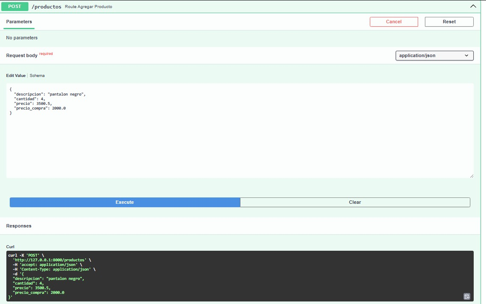
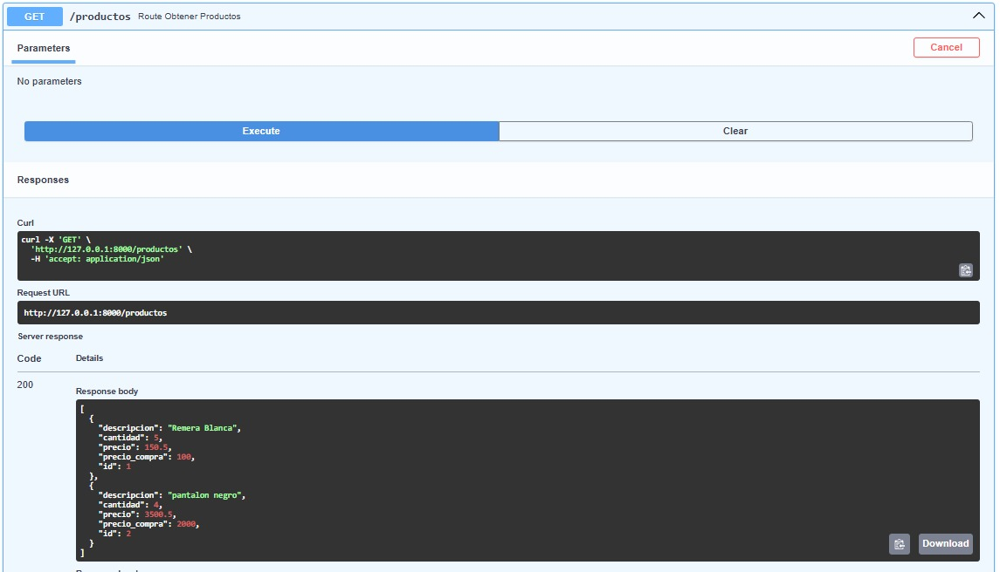
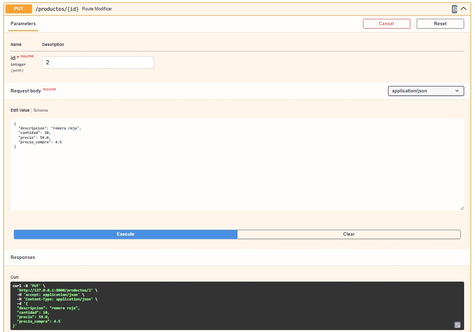
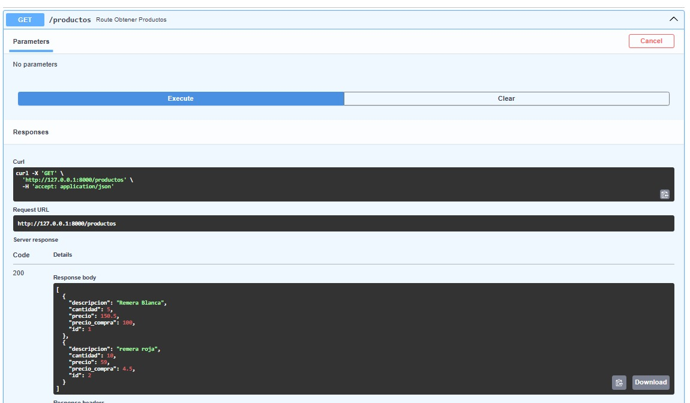
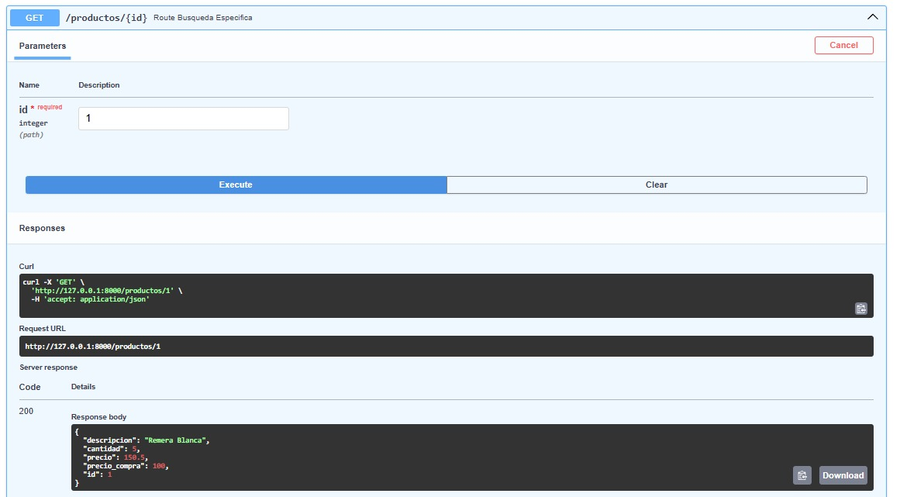
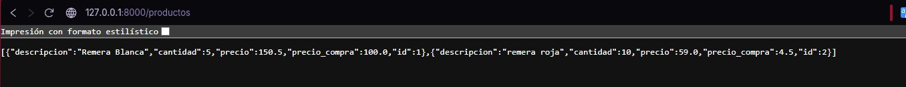

# Inventario Ropa API

## ¿Por qué hice este proyecto?

Tengo un pequeño emprendimiento de venta de ropa y necesitaba una forma de gestionar mi stock de manera eficiente. En lugar de usar planillas o anotaciones manuales, decidí construir mi propia aplicación para aprender y resolver un problema real al mismo tiempo.

## ¿Qué hace?

API REST para gestión de inventario de ropa que permite controlar el stock de productos, registrar ventas y mantener un registro actualizado de mercadería.

## Endpoints

| Método | Ruta | Descripción |
|--------|------|-------------|
| `GET` | `/productos` | Listar todos los productos |
| `POST` | `/productos` | Agregar un nuevo producto |
| `PUT` | `/productos/{id}/vender` | Registrar una venta y descontar stock |

## Tecnologías

- **Python**
- **FastAPI**
- **Pydantic**
- **Uvicorn**

## Cómo correrlo

```bash
# Instalar dependencias
pip install fastapi uvicorn

# Correr el servidor
uvicorn backend.app.main:app --reload
```

Luego entrá a `http://127.0.0.1:8000/docs` para ver y probar los endpoints.

## Estado actual

La base de datos es **en memoria**, los datos se pierden al reiniciar el servidor. Esto es intencional por ahora mientras se desarrolla la lógica principal de la API.

## Roadmap

Este proyecto está en desarrollo activo. A futuro planeo:

- [ ] Integrar base de datos con **PostgreSQL + SQLAlchemy**
- [ ] Agregar autenticación de usuarios
- [ ] Construir un frontend con **React**
- [ ] Deployar como aplicación **full stack** completa

### Agregar un producto


### Verificamos la lista


### Agregamos un segundo producto


### Verificamos la lista actualizada


### Modificamos un producto por ID


### Verificamos la modificación


### Buscamos un producto por ID


### Demostración final
